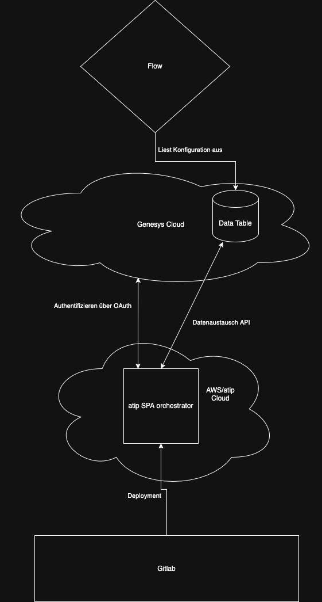

# atip_orchestrator


## Startup Guide

Checkout repository

## Architecture



# 📁 Projektstruktur – Lebensreise Frontend Framework

Dieses Projekt ist ein leichtgewichtiges SPA-Frontend-Framework auf Basis von **TailwindCSS**, **Alpine.js** und **Vite**. Die `index.html` bildet den Einstiegspunkt der Anwendung und verwendet `x-route`, um zwischen einzelnen Modulen (Seiten) zu navigieren.

---

## 📂 Ordnerstruktur

```
Root/
├── css/                # Tailwind CSS-Eingabedateien (z. B. styles.css)
├── dist/               # Ausgabeverzeichnis nach dem Build (nicht im Git)
├── js/                 # Globale JavaScript-Logik und Helfer
├── pages/              # Module: eigenständige Bereiche wie diy, matrix, etc.
├── public/             # Statische Dateien wie Logos
├── index.html          # Einstiegspunkt, nutzt x-route für Routing
├── tailwind.config.js  # Tailwind-Konfiguration
├── vite.config.js      # Vite-Build-Konfiguration
└── package.json        # Abhängigkeiten und Scripts
```

---

## 🧱 Modulaufbau (`pages/`)

Jedes Modul befindet sich in einem eigenen Unterordner innerhalb von `pages/` und besteht mindestens aus:

- einer HTML-Datei (`modulename.html`)
- einer zugehörigen JavaScript-Datei (`modulename.js`)

### ✅ Beispiel:

```
pages/
├── announcement/
│   ├── announcement.html
│   └── announcement.js
├── diy/
│   ├── diy.html
│   └── diy.js
├── matrix/
│   ├── matrix.html
│   └── matrix.js
```

Diese Module werden in `index.html` dynamisch eingeblendet – gesteuert über Alpine.js und `x-route`.

---

## 🧠 Globale JavaScript-Struktur (`js/`)

Die `js/`-Struktur beinhaltet zentrale Komponenten und Dienste:

- `main.js` – Einstiegspunkt, der globale Stores und Initialisierung verwaltet
- Hilfsfunktionen & Services:
  - `aiAssist.js`
  - `AiGenService.js`
  - `dragBar.js`
  - `genesys_helper.js`

Diese Dateien bieten Funktionen, die von mehreren Modulen genutzt werden können.

---

## 🎨 Styling (`css/`)

Alle individuellen TailwindCSS-Erweiterungen und Komponenten befinden sich in `css/styles.css`. Diese Datei wird mit Vite und Tailwind kompiliert und als einzige CSS-Datei in `dist/` ausgeliefert.

---

## 🖼 Public Assets (`public/`)

Aktuell befinden sich hier die **Logos** der Anwendung. Diese Struktur sollte langfristig vereinheitlicht werden (z. B. Unterordner `public/img/`, `public/icons/`, etc.).

---

## 🚀 Build & Entwicklung

- Lokale Abhängigkeiten installieren: `npm install`
- Lokale Entwicklung: `npm run dev`
- Build für Produktion (Output in `dist/`): `npm run build`

> ⚠️ Der `dist/`-Ordner ist **nicht im Git-Repository enthalten**. Er wird lokal für Produktionstests erzeugt und dient nicht als Quelle für die Versionierung.

---

## 📌 Nächste Schritte

Im nächsten Abschnitt folgt ein **Contribution Guide**, der beschreibt:

- Wie ein neues Modul erstellt wird
- Welche Konventionen zu beachten sind
- Wie mit globalen Stores gearbeitet wird
- Wie Komponenten wiederverwendbar gestaltet werden

➡️ [Gehe zu CONTRIBUTING.md (folgt im nächsten Schritt)]
